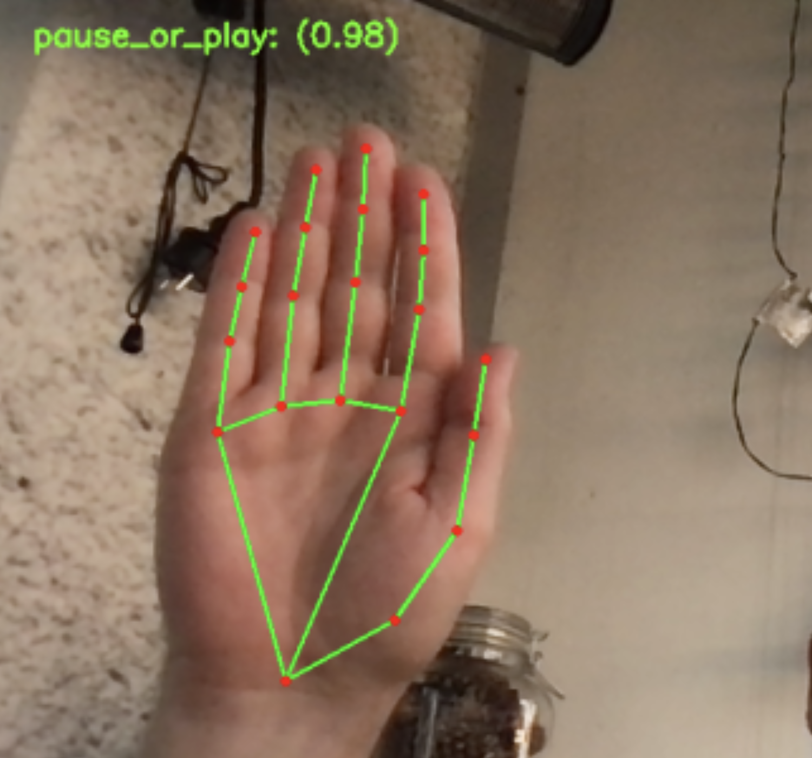
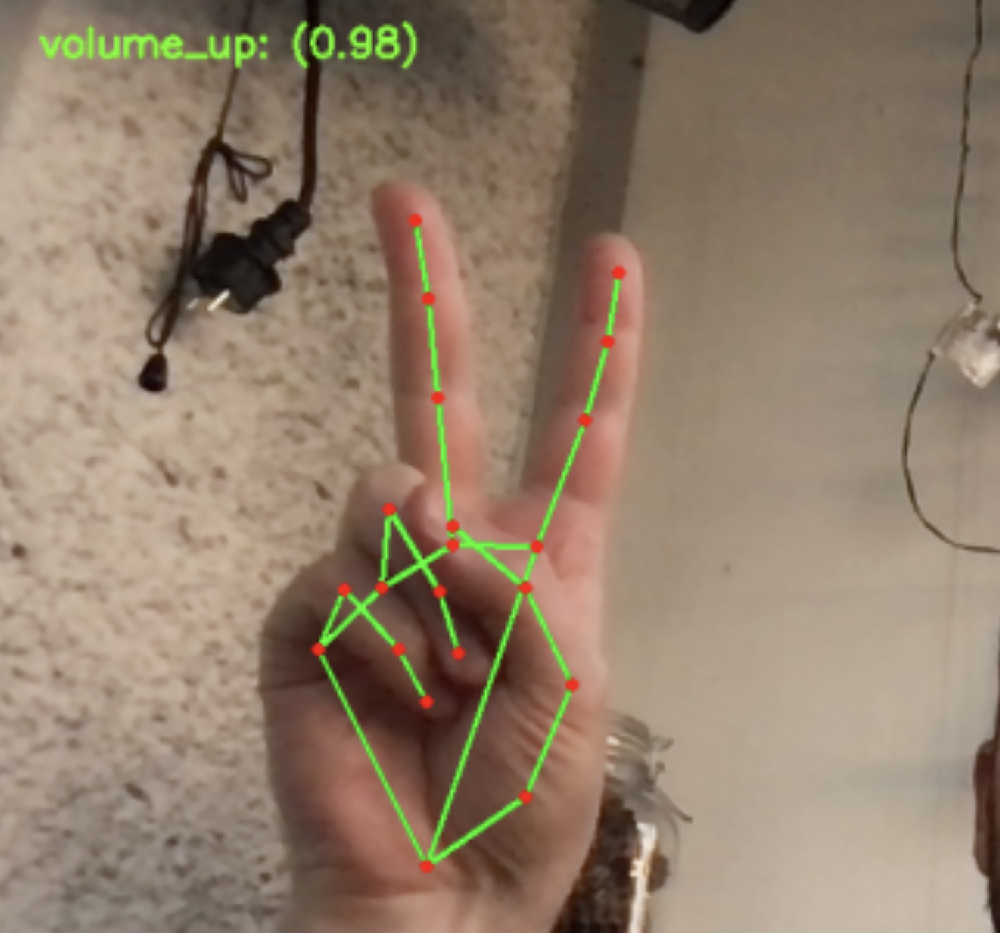
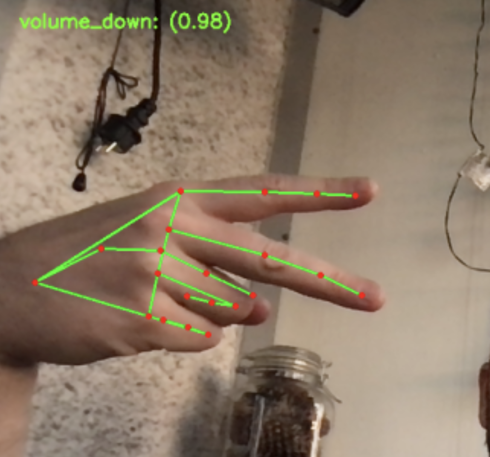
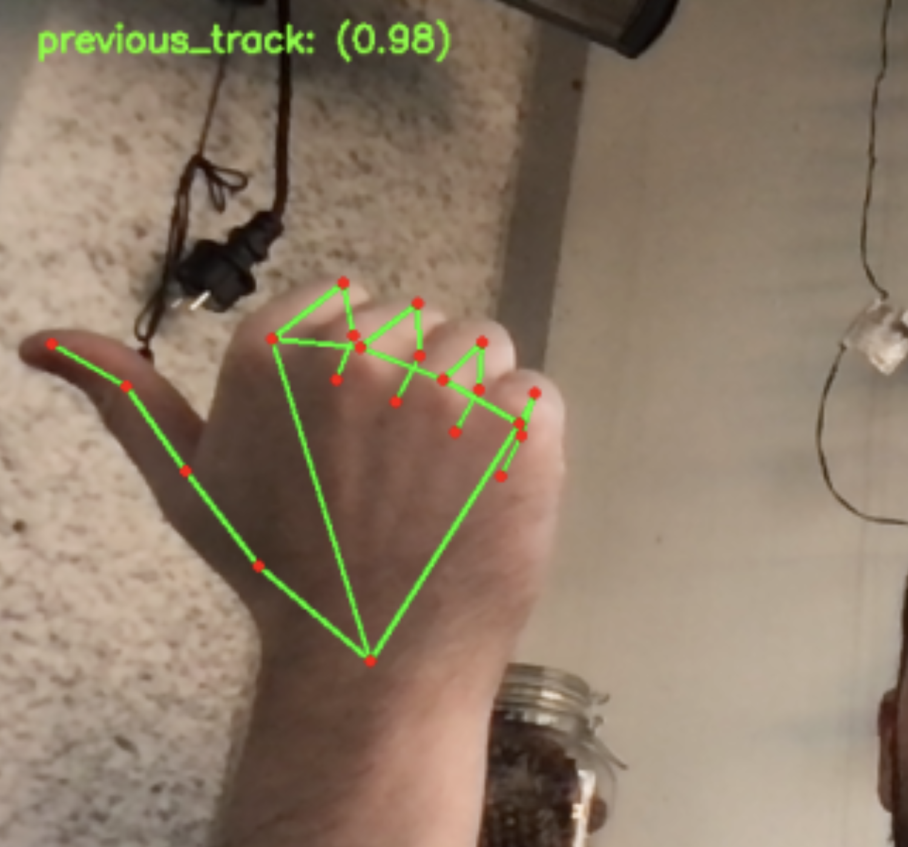
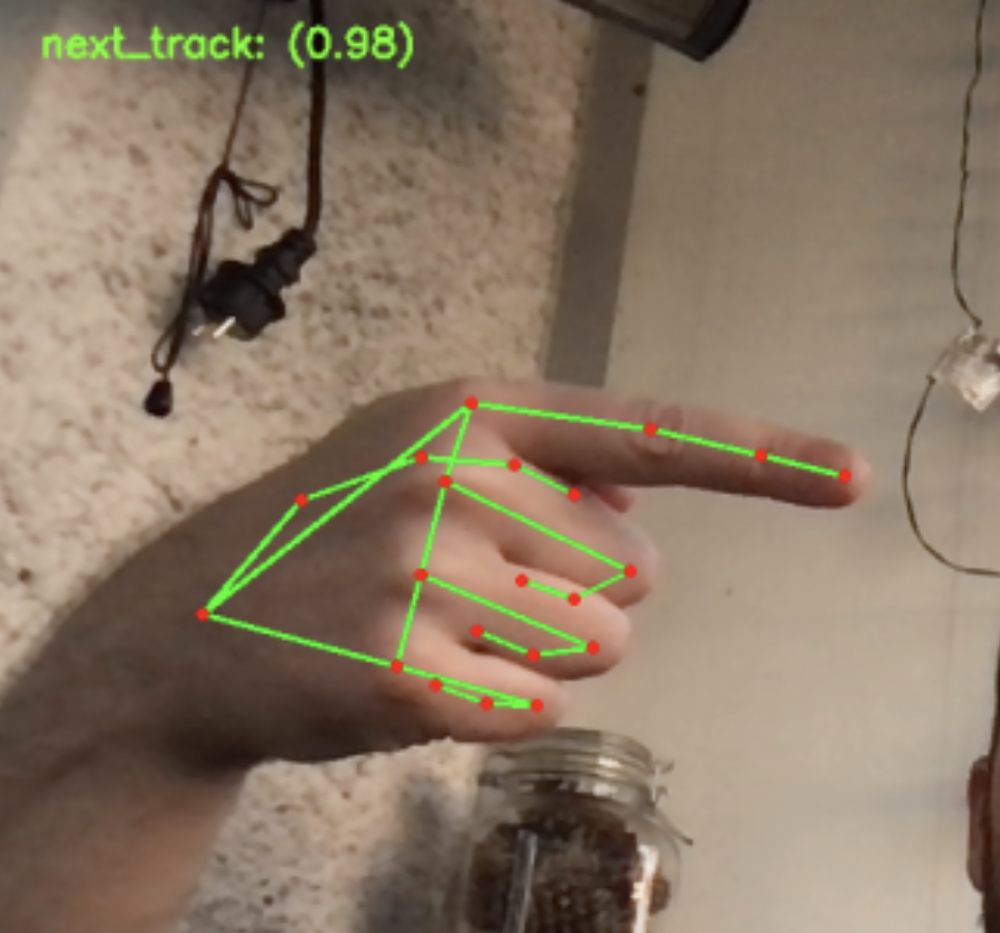
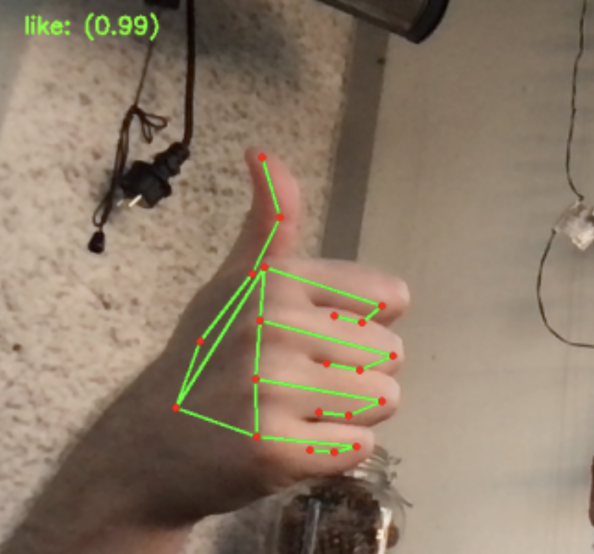
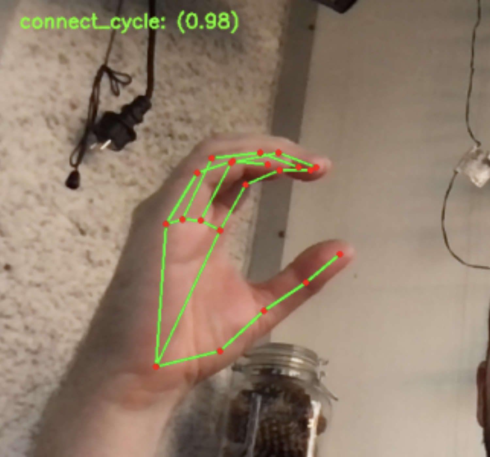

# Authors:

This project forked from the fine work of:
* Luiz Henrique da Silva Santos - https://github.com/luizhss/ - https://www.linkedin.com/in/luizhssantos/
* Matheus Vyctor Aranda Espíndola - https://github.com/Matheus-Vyctor/ - https://www.linkedin.com/in/matheus-vyctor/

Their original repo: https://github.com/luizhss/Gesture_Hand_Controller

Modified for use with Spotify Connect APIs by:
* Jon Dumm - https://github.com/jdumm

# Spotify Gesture Controls
Control Spotify playback via hand gestures and your webcam.  

Runs smoothly at about 30 fps on my macbook. 


## Supported Functions - Left-hand only in pre-trained model!

* Play/pause
* Volume up
* Volume down
* Previous track
* Next track
* Like song
* Cycle through active Spotify Connect devices

       

## Quick start

Clone this repo, cd in and install dependencies using:
```
pip install -r requirements.txt
```

You will need your own Spotify Client Credentials, following the [setup instructions from
 Spotify](https://developer.spotify.com/documentation/web-api/quick-start/)
and [client credentials flow from Spotipy](https://spotipy.readthedocs.io/en/2.18.0/#client-credentials-flow).
You will be asked to log into your personal Spotify account on the first execution.  

Summary of steps above: 
* Sign up as a Spotify developer
* Create an app with name 'Spotify Gesture Controller' and description 'Use hand gestures to
 control Spotify playback' 
* In the new app's dashboard: Edit Settings --> Redirect URIs --> "http://localhost:8888/callback
" --> Add --> Save
* Create a local copy of the client credentials in your OS environment.  This example should work
 for macOS and Linux:  
```
export USERNAME=<a user name, probably good to match your Spotify username>
export SPOTIPY_CLIENT_ID=<from the app dashboard>
export SPOTIPY_CLIENT_SECRET=<from the app dashboard>
export SPOTIPY_REDIRECT_URI=http://localhost:8888/callback
```
It can be handy to put those env variables into a local env.sh file and `source env.sh`.

To start gesture recognition (allow webcam permissions when prompted), execute:
```
python gesture_controller.py
```

## How it works
Uses [Mediapipe Hand](https://google.github.io/mediapipe/solutions/hands) solutions to get the hand 
landmarks predictions from webcam, which collects frames using [OpenCV](https://opencv.org/). 
This gives coordinates of hand 'landmarks' in 3D.  These data are passed to a multiclass
classifier (currently sklearn's SVC), which recognizes custom-trained gestures.  Retraining is
 possible quite quickly with a utility to generate new training samples.  Once a gesture
is recognized, [Spotify API](https://developer.spotify.com/documentation/web-api/quick-start/) 
commands are executed using Python interface [Spotipy](https://spotipy.readthedocs.io/en/2.18.0/). 

